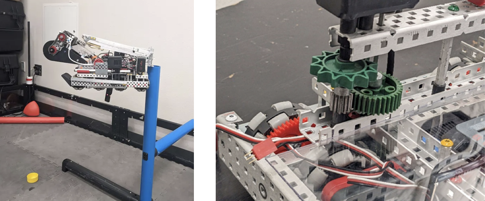
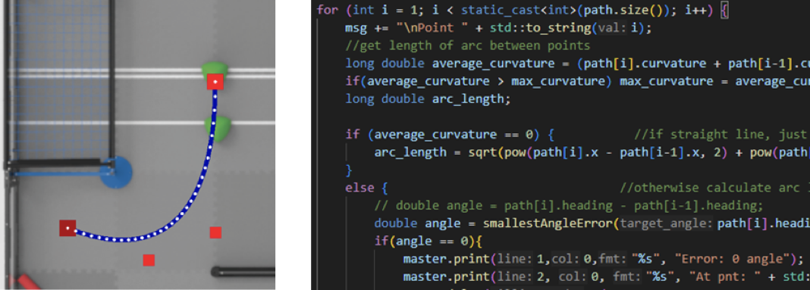

# About the Team

In the Vex U robotics competition, we design, build, and program robots to compete in challenges that change every year (think FTC/FRC but cooler). Each year in late April, we fly to Dallas, TX, to compete in the World Championship. Vex U is highly competitive, with over 300 teams competing, representing more than 20 countries.

Last year, we reached the division semi-finals at the World Championship, securing an impressive 6th place overall. This season, we’ve held the prestigious title of number 1 in the world in the skills challenge portion of the competition for several weeks, securing an invitation to this year’s world championship.

# Projects

- **Mechanical Design** – With the competition changing every year, we must design and build mechanisms to perform tasks such as collecting balls, launching disks, and lifting the robots off the ground. It often requires creativity and out-of-the-box thinking to build mechanisms that are fast, consistent, and save space.

- **Software** – With a 45 second autonomous period, a fast and reliable autonomous program is invaluable. We have proudly developed relatively sophisticated motion control systems in C++, but there is still a lot of room for improvement. With your help, we could improve our robots’ speed and consistency during autonomous. We also aspire to implement Raspberry Pis and camera vision at some point

- **CAD and 3D Printing** – When we need parts that are difficult to build, an easy way to manufacture them is through 3D printing. Those interested in using CAD and 3D printing to create parts for the team, or modeling our robots in general, will have plenty to do in Vex U.

